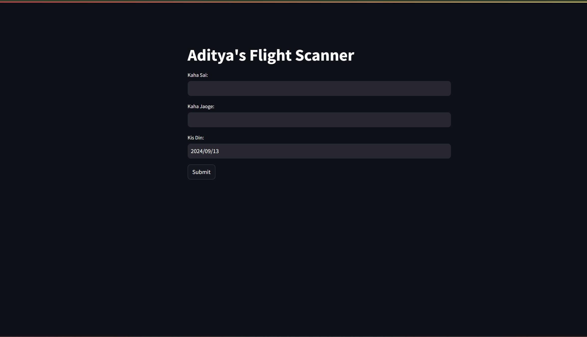
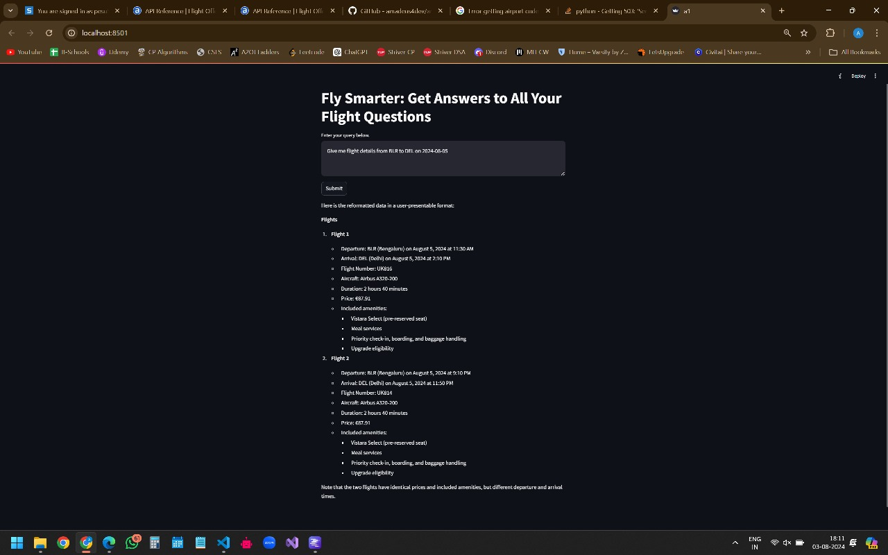
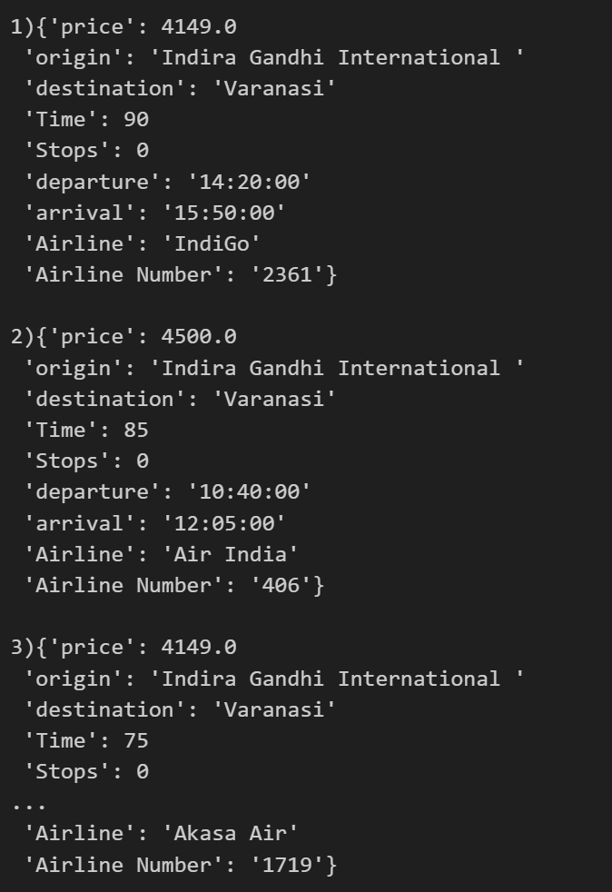

# ✈️ Aditya's Flight Scanner

Welcome to **Aditya's Flight Scanner**, a simple yet powerful flight search engine that uses the Skyscanner API to find the best flights for you. This project is built using **Streamlit** for the frontend and **Python** for backend API integration.

## 🎯 Features

- Real-time flight search with Skyscanner API
- Clean and minimalistic interface
- Displays flight details like price, origin, destination, time, stops, airline, and flight number
- Responsive and easy to use
- Built-in error handling and user-friendly error messages

---

## 🖼️ Screenshots

### 1. **Interface Preview**
 <!-- Add link to interface screenshot -->

### 2. **Further Plans: Currently working, not pushed in repo**
 <!-- Add link to further plans/improvements screenshot -->


### 3. **Data Fetching: If API quota in not full then you will get data like this**

---


## 🚀 Future Plans

Here are some ideas for future enhancements:

We want to use LLMs to make its interface like a chatbot, we are currently working on it.
1. **Multi-city flight search**: Ability to search for flights with multiple destinations.
2. **Price comparison chart**: Graphical representation of flight prices over time.
3. **User Authentication**: Allow users to save their searches and flight preferences.
4. **Email Notification**: Send alerts to users when flight prices drop.
5. **Language Support**: Add multi-language support for a global audience.

---


## 🛠️ Technologies Used

- **Frontend**: Streamlit
- **Backend**: Python (API Integration)
- **API**: Skyscanner (via RapidAPI)
- **Styling**: Bootstrap (for frontend styling)

---

## 🎯 How to Run the Project Locally

1. Clone the repository:
   ```bash
   git clone https://github.com/username/flight-scanner.git
   cd flight-scanner
   ```
2. Install the required dependencies:

```bash
  pip install -r requirements.txt
  Run the application:
```
3. 
```bash
streamlit run app.py
```


## 🧑‍💻 Contribution
Feel free to fork this repository, create a feature branch, and submit a pull request with your improvements!

Happy coding!

## 🌟 Contact
If you have any questions or feedback, feel free to reach out at:

Email: iamavs2002@gmail.com
